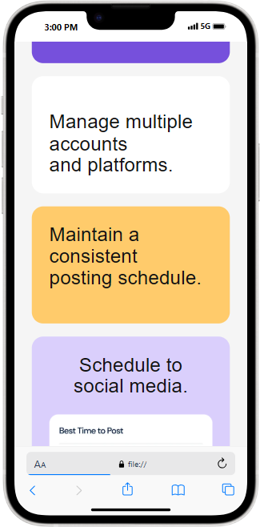

# Frontend Mentor - Bento grid

## Welcome! 👋

# Frontend Mentor - Bento Grid Solution

This is my solution to the [Bento Grid challenge on Frontend Mentor](https://www.frontendmentor.io/challenges/bento-grid-RMydElrlOj).

## Overview

### The challenge

Users should be able to:

- View the optimal layout for the interface depending on their device's screen size
- See hover states for interactive elements

### Screenshots

### Links

- Solution URL: [GitHub Repository](https://github.com/brain-berry/bento-grid-challenge)

## My process

### Built with

- Semantic HTML5
- CSS Grid
- Responsive design using media queries
- [DM Sans](https://fonts.google.com/specimen/DM+Sans) from Google Fonts

- ## 📦 How to Use

1. Clone or download the repository
2. Open `index.html` in your browser
3. Or visit the [Live Preview](https://brain-berry.github.io/bento-grid-challenge/) on GitHub Pages

## 💡 Credits

- Challenge by [Frontend Mentor](https://www.frontendmentor.io)
- Coded by [Henry Benson]

---

## 🌐 Live Demo

🔗 [View Website](https://brain-berry.github.io/bento-grid-challenge/)

### What I learned

I improved my understanding of advanced CSS Grid techniques, and how to create asymmetrical layouts that adapt to different screen sizes.

## Author

- Frontend Mentor - [@brain-berry](https://www.frontendmentor.io/profile/brain-berry)
